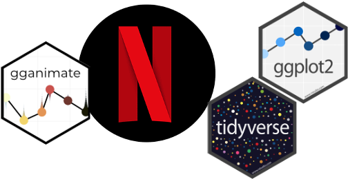

```{r setup, include=FALSE}
options(htmltools.dir.version = FALSE)
```
# Sobre mí

.pull-left[
<br /> 
<br /> 
<br /> 
* Primera experiencia con R en 2013

* Psicómetra

* Investigadora y profesora en UOC

* Paquetes favoritos: _ggplot2, lavaan, psych_
]

.pull-right[


`r icons::fontawesome("envelope", style = "solid")` ariadna.angulo.brunet@gmail.com
`r icons::fontawesome("twitter")` AnguloBrunet
`r icons::fontawesome("github")` AnguloB
]
---
# El taller

* Conceptos básicos para realizar gráficos animados

* Realizar una descripción inicial de los datos

* Crear un gráfico animado "fácil"

* Personalizar los gráficos  con _themes_ 

* Experimentar creando gráficos

```{r echo=FALSE, fig.height=5}

```

---
class: inverse, middle, center
# Los básicos
---

# ggplot2()
La estructura básica
```{r, eval=FALSE}
datos %>%
  ggplot(aes(x = variable1, y = variable2)) + 
  geom_XXXX()
```

- *aes* : _x, y, color, fill, shape,..._

- *geom*: _geom_point(), geom_col(), geom_boxplot(), geom_density()_

Personalizar

```{r, eval = FALSE}
plot + theme()
```

- Prestablecidos: _theme_bw(), theme_classic(), theme_dark()_

- Personalizados: modificando theme()

---
# gganimate()


.pull-left[
- Gramática "extendida" para ggplot2()  -    https://gganimate.com

- transition_*()
    - transition_states()
    - transition_events()
    - transition_manual()
    - ... 
    
+ shadow_*() 
    - shadow_mark()
    - shadow_trail()
    
+ enter_*()/exit_*()
+ ease_aes() 
]
.pull-right[

_Artwork by @allison_horst_]


---
# animate()

El output "defecto" es muy mejorable. 
- Podemos "renderizar" y personalizar la salida con animate()[https://gganimate.com/reference/animate.html]

```{r, eval = FALSE}
animate(plot1, height=6, width=11, units="in", res = 150)
```

<br />
<br /> 
<br /> 
Si queremos exportar puede ser útil, 

```{r, eval = FALSE}

anim_save("plot1.gif", animation = last_animation())

anim_save("plot1.png", animation = last_animation())

```


---
class: inverse, middle, center
# El taller
---
# NETFLIX 

- [Datos de #tidytuesday abril 2021](https://github.com/rfordatascience/tidytuesday/blob/master/data/2021/2021-04-20/readme.md)
- De [Kaggle](https://www.kaggle.com/shivamb/netflix-shows?select=netflix_titles.csv) por Shivam Bansal

```{r, include=FALSE}
library(tidyverse)
library(knitr)


netflix <- netflix_titles <- readr::read_csv('https://raw.githubusercontent.com/rfordatascience/tidytuesday/master/data/2021/2021-04-20/netflix_titles.csv')

```


```{r, echo = FALSE}
funcion1 <- function(x) data.frame(lapply(x, substr, 1, 5))


netflix[2539,1:6] %>% kable()
netflix[2539,7:12] %>% kable()

```
