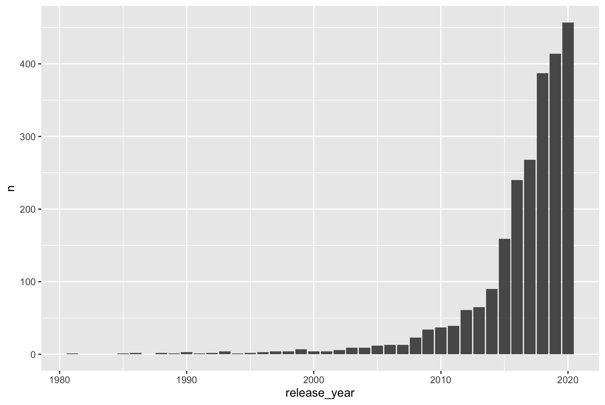
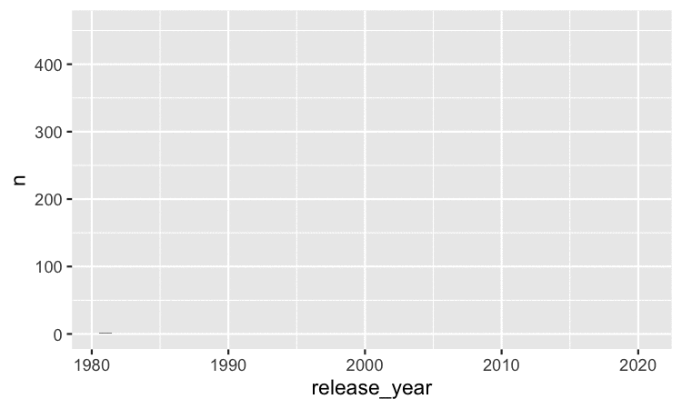
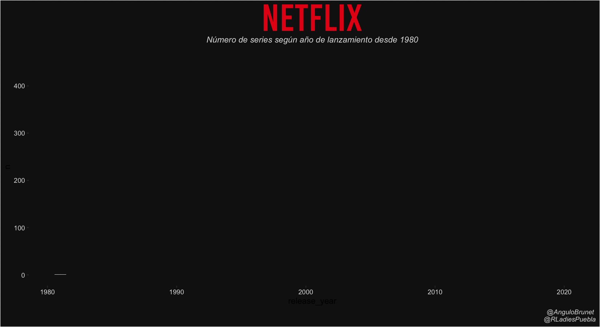
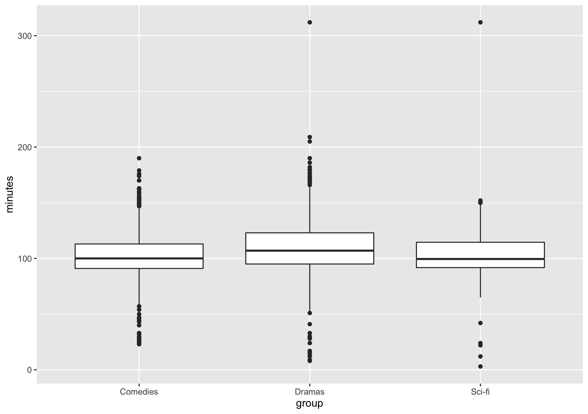
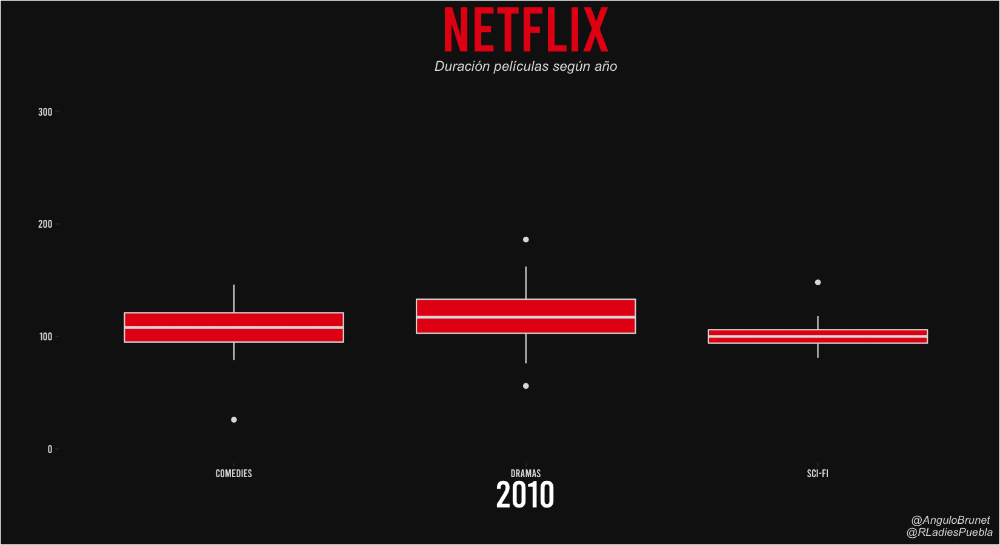

# Gráficos animados en R con datos de Netflix

#### Ariadna Angulo-Brunet

 

Este texto forma parte de la presentación desarrollada el 24 de julio de 2021 para [Rladies Puebla](https://twitter.com/rladiespuebla?lang=es). También puedes encontrar las diapositivas [aquí](0_slides.pdf) y los Scripts completos en [esta carpeta](/Scripts). El objetivo principal es aprender a realizar gráficos animados. Para ello vamos a aprender a personalizar _themes_ que nos puedan resultar atractivos para los diferentes gráficos que vamos a realizar. 

Vamos a necesitar los siguientes paquetes:

```R
library(tidyverse)
library(gganimate)
```

Además, si quieres personalizar el tipo de fuente del texto necesitaras también,

`library(extrafont)`

Para este tutorial me he descargado la fuente “Bebas” https://www.dafont.com/es/bebas.font?text=netflix&psize=l que simula las letras del logo de Netflix. Si es la primera vez que utilizas este paquete o has cargado librerías nuevas en tu ordenador es necesario que ejecutes la siguiente línea (puede tardar unos minutos): 

`loadfonts()`

Para este ejemplo vamos a trabajar con datos disponibles [en el repositorio de tidytuesday](Para este ejemplo vamos a trabajar con datos disponibles en el repositorio de tidytuesday). En la presentación puedes encontrar más información sobre esto. 

```R
tuesdata <- tidytuesdayR::tt_load(2021, week = 17)
netflix <- tuesdata$netflix
```

En primer lugar, empezaremos realizando un grafico sencillo, partiendo del recuento de series de televisión por año. Para ello, primeramente crearemos un conjunto de datos “serie” que contenga solo las series de televisión,

```R
series <- netflix %>%    
filter (type == "TV Show")
```


## Gráfico de columnas

En las siguientes líneas especificaremos que queremos filtrar series entre 1980 y 2020, hacer un recuento, y además realizar un grafico de columnas donde en el eje _x_ este representado el año de emisión, y en la _y_ el recuento previamente creado, 


```R
p1 <- series %>%
    filter(release_year >= 1980) %>%
    filter(release_year <= 2020) %>%
    group_by(release_year) %>%
    count() %>%
    ggplot(aes(x= release_year, y = n)) +
    geom_col() 
```




A partir de ahora tendremos un doble objetivo: mejorar la visualización y animar las columnas de forma que aparezcan ordenadas por año. 

Para empezar a ver resultados, vamos a añadir una animación. En realidad es muy fácil. Hay que añadir la transición (aunque hay diferentes tipos ahora nos centraremos en transition states). Para ello simplemente vamos a indicar la variable que queremos que “cambie”  y además indicaremos que no queremos que lo que aparece desaparezca enseguida con shadow_mark

```R
p1 + 
transition_states(release_year) +
shadow_mark()
```



Para que el gráfico parezca más atractivo vamos a personalizar el _theme_

```R
p1 <- series %>%
    filter(release_year >= 1980)%>%
    filter(release_year <= 2020)%>%
    group_by(release_year) %>%
    count() %>%
    ggplot(aes(x= release_year, 
               y = n, 
               fill = n)) +  #cambiar en función del recuento
    geom_col() +
    scale_fill_gradient(low = "#DEDEDE", high = "#e50914")+ #color de las columnas
    labs(title = "NETFLIX",  #Título principal
         subtitle = "Número de series según año de lanzamiento desde 1980", 
         caption = "@AnguloBrunet \n @RLadiesPuebla") +
    theme(axis.text=element_text(colour="#DEDEDE"), #color del texto general a gris
            plot.title = element_text(color = "#e50914", size = 50, #color y tamaño título
                                      hjust = .5, face = "bold", #título centrado negrita
                                      family = "Bebas"), #Fuente elegida título
           plot.subtitle = element_text(color = "#DEDEDE", hjust = .5,
                                        face = "italic"), #subtítulo cursiva
           plot.caption = element_text(color = "#DEDEDE", face = "italic"),
           panel.background = element_rect(fill = '#141414'), #modificar color panel fondo
           plot.background=element_rect(fill = "#141414"), #modificar fondo
           panel.border = element_blank(), #eliminar bordes
           panel.grid.major = element_blank(), #eliminar grid
           panel.grid.minor = element_blank(), #eliminar grid
           legend.position = "none") + #eliminar leyenda del color
    transition_states(release_year,wrap = FALSE) + #transición
    shadow_mark() #evita que las columnas desaparezcan
```

Para guardar el plot en primer lugar especificaremos como queremos que sea, 

```R
animate(p1,   
        height=6, width=11, units="in", res = 150,
        rewind = FALSE)
```

Una vez lo hemos especificado utilizaremos la función anim_save, 

```R
anim_save("explicacion/md_3.gif", animation = last_animation())
```




## boxplot 

Ahora que ya hemos visto los básicos de como animar un grafico, vamos a seguir practicando. Para ello vamos a realizar un grafico de cajas y bigotes y vamos a centraros solo en las películas. Compararemos películas catalogadas como comedias, dramas o ciencia ficción y veremos a lo largo de los años como ha cambiado la duración de las películas. 

En primer lugar, filtramos la base de datos para que solo tenga películas. Además, quitaremos el texto “min” de la variable “Duration” y lo convertiremos en un número. 

```R
movies <- netflix %>%
    filter(type == "Movie") %>%
    mutate(minutes = as.numeric(str_remove(duration, " min")))
```

Ahora vamos a crear un conjunto de datos que solo incluya aquellas filas en las cuales se detecte “Comedies”, “Dramas” o “Sci-Fi & Fantasy”. Aunque hay formas más elegantes de hacerlo lo haremos por pasos creando conjuntos de datos intermedios. 

```R
comedies<-movies %>%
    filter(str_detect(listed_in, 'Comedies'))%>%
    mutate(group = "Comedies") #Creo variable grupo con el valor "Comedies"

dramas<-movies %>%
    filter(str_detect(listed_in, 'Dramas')) %>%
    mutate(group = "Dramas") #Creo variable grupo con el valor "Dramas"

scifi <-movies %>%
    filter(str_detect(listed_in, 'Sci-Fi & Fantasy')) %>%
    mutate(group = "Sci-fi") #Creo variable grupo con el valor "Sci-fi"

df <-rbind(comedies, dramas, scifi) #Creo una base de datos conjunta 
```

En primer lugar voy a crear un boxplot sin animar, donde en el eje de las _x_ encontraremos el tipo de película, y en la _y_ la duración. 

```R
df %>%
   filter(release_year %in% c(2010:2020))%>%
    ggplot(aes(x = group, y = minutes)) +
    geom_boxplot()    
```



A partir de aqui vamos a personalizarlo para animarlo, y también para que quede más bonito. En este caso solo vamos a comentar los elementos que son diferentes al gráfico inicial.

```R
p3<-df %>%
    filter(release_year %in% c(2010:2020))%>%
    ggplot(aes(x = group, y = minutes)) +
    geom_boxplot(fill= "#e50914", color ="#DEDEDE")  +
    labs(title = "NETFLIX", 
         subtitle = "Duración películas según año", 
         caption = "@AnguloBrunet \n @RLadiesPuebla", 
         x = '{closest_state}', # Permite añadir un título dinámico
         y = "")+
    theme( axis.text=element_text(colour="#DEDEDE", family = "Bebas"), #modificamos el texto
          # de x y de "y" para que sea todo con la misma letra
           plot.title = element_text(color = "#e50914",
                                     size = 50, hjust = .5, face = "bold", family ="Bebas"),
           plot.subtitle = element_text(color = "#DEDEDE", hjust = .5, face = "italic"),
           plot.caption = element_text(color = "#DEDEDE", face = "italic"),
           axis.title= element_text(family = "Bebas", colour = "white", size =30),
           panel.background = element_rect(fill = '#141414'),
           plot.background=element_rect(fill = "#141414"),
           panel.border = element_blank(),
           panel.grid.major = element_blank(),
           panel.grid.minor = element_blank(), 
           legend.position = "bottom", #mantenemos la leyenda
           legend.background = element_rect(fill='#141414'),  #modificamos el fondo de 
          #la leyenda para que quede del mismo color que el fondo del gráfico
           legend.text = element_text(colour="#DEDEDE", family = "Bebas")) + #cambiamos
					#el tipo de letra de la leyenda para que quede igual que el resto
    transition_states(
        release_year) #los cambios en el gráfico se harán según release year

animate(p3,   
        height=6, width=11, units="in", res = 150,
        rewind = FALSE)

anim_save("02_peliculas_box.gif", animation = last_animation())
```




## tile

Para terminar con ejemplos haremos un “tile”. Representaremos con cuadraditos las frecuencias según día del año.  Para ello en primer lugar trabajaremos los datos un poco. Con el paquete lubridate

```R
library(lubridate)

df<-netflix %>%
    filter (type == "Movie")%>% #Filtro solo peli
    group_by(date_added) %>% #Agrupo por fecha
    count() %>% #hago un recuento
    mutate(fecha = mdy(date_added)) %>% #transformo la fecha del formato qe hay
    mutate(dia = day(fecha)) %>% #extraigo dia
    mutate(mes = month(fecha)) %>% #extraigo mes
    mutate(anyo = year(fecha)) %>% #extragio año
    mutate(mes = case_when(mes == 1 ~ "Enero",  #traduzco mes
                           mes == 2 ~ "Febrero", 
                           mes == 3 ~ "Marzo", 
                           mes == 4 ~ "Abril", 
                           mes == 5 ~ "Mayo", 
                           mes == 6 ~ "Junio", 
                           mes == 7 ~ "Julio", 
                           mes == 8 ~ "Agosto", 
                           mes == 9 ~ "Septiembre", 
                           mes == 10 ~ "Octubre", 
                           mes == 11 ~ "Noviembre",
                           mes == 12 ~ "Diciembre" )) %>%
    mutate(mes = factor(mes, levels = c("Diciembre", "Noviembre", #pongo en orden
                                        "Octubre", "Septiembre", 
                                        "Agosto", "Julio", 
                                        "Junio", "Mayo", 
                                        "Abril", "Marzo", 
                                        "Febrero", "Enero"))) 
```

En este caso filtraremos películas añadidas entre 2015 y 2020, en el eje _x_ pondremos el dia (1 al 31), en la _y_ el mes, y el relleno (fill) será el recuento. 

```R
p2 <- df %>%
    filter(anyo %in% c(2015:2020))%>%
    ggplot(aes(x=factor(dia), y = factor(mes), fill = n)) +
    geom_tile() +
    scale_fill_gradient(low = "#43465e", high = "#e50914")+ 
    labs(title = "NETFLIX", 
         subtitle = "Fecha en que la película fue añadida", 
         caption = "@AnguloBrunet \n @RLadiesPuebla", 
         x = '{closest_state}',
         y = "")+
    theme( axis.text=element_text(colour="#DEDEDE", family = "Bebas"), 
           plot.title = element_text(color = "#e50914", size = 50, hjust = .5, face = "bold", family = "Bebas"),
           plot.subtitle = element_text(color = "#DEDEDE", hjust = .5, face = "italic"),
           plot.caption = element_text(color = "#DEDEDE", face = "italic"),
           axis.title= element_text(family = "Bebas", colour = "white", size =30),
           panel.background = element_rect(fill = '#141414'),
           plot.background=element_rect(fill = "#141414"),
           panel.border = element_blank(),
           panel.grid.major = element_blank(),
           panel.grid.minor = element_blank(), 
           legend.position = "bottom", 
           legend.background = element_rect(fill='#141414'), 
           legend.text = element_text(colour="#DEDEDE", family = "Bebas")) +
    transition_states(anyo,
                      wrap = FALSE, 
                      transition_length = 1,
                      state_length = 4) + #añadimos tiempo a cada diapositiva 
    #para poder visualizar mejor
    shadow_mark() 
    


animate(p2,   
        height=6, width=11, units="in", res = 150,
        rewind = FALSE)

anim_save("03_peliculas.gif", animation = last_animation())
```


Como se puede ver, cada año se añaden más películas, y en general estas se añaden en enero. Siendo el día 1 de enero de 2020 uno de los días en los que se han añadido mas películas.

Para finalizar vamos a examinar si podemos distinguir alguna cosa según el dia de la semana. Para ello, necesitamos saber que dia de la semana (lunes, martes, miércoles) es cada fecha con la función weekdays

```R
df1 <- netflix %>%
    filter(type == "Movie")%>%
    mutate(fecha = mdy(date_added)) %>% #transformo la fecha del formato qe hay
    mutate(mes = month(fecha)) %>% #extraigo mes
    mutate(anyo = year(fecha)) %>% #extragio año
    mutate(mes = case_when(mes == 1 ~ "Enero",  #traduzco mes
                           mes == 2 ~ "Febrero", 
                           mes == 3 ~ "Marzo", 
                           mes == 4 ~ "Abril", 
                           mes == 5 ~ "Mayo", 
                           mes == 6 ~ "Junio", 
                           mes == 7 ~ "Julio", 
                           mes == 8 ~ "Agosto", 
                           mes == 9 ~ "Septiembre", 
                           mes == 10 ~ "Octubre", 
                           mes == 11 ~ "Noviembre",
                           mes == 12 ~ "Diciembre" )) %>%
    mutate(mes = factor(mes, levels = c("Diciembre", "Noviembre", 
                                        "Octubre", "Septiembre", 
                                        "Agosto", "Julio", 
                                        "Junio", "Mayo", 
                                        "Abril", "Marzo", 
                                        "Febrero", "Enero"))) %>%
    mutate(dayoftheweek= weekdays(fecha))%>%
    mutate(dayoftheweek = factor(dayoftheweek, 
                                 levels = c("Monday", "Tuesday", "Wednesday",  "Thursday", 
                                            "Friday", "Saturday", "Sunday"))) %>%
    group_by(anyo,mes,  dayoftheweek) %>%
    count()


```

Siguiendo la lógica anterior, 

```R
p3 <- df1 %>%
    filter(anyo %in% c(2015:2020))%>%
    ggplot(aes(x=dayoftheweek, y = factor(mes), fill = n)) +
    geom_tile() +
    scale_fill_gradient(low = "#43465e", high = "#e50914")+ 
    labs(title = "NETFLIX", 
         subtitle = "Día de la semana y año cuando la película fue añadida", 
         caption = "@AnguloBrunet \n @RLadiesPuebla", 
         x = '{closest_state}',
         y = "")+
    theme( axis.text=element_text(colour="#DEDEDE", family = "Bebas"), 
           plot.title = element_text(color = "#e50914", size = 50, hjust = .5, face = "bold", family = "Bebas"),
           plot.subtitle = element_text(color = "#DEDEDE", hjust = .5, face = "italic"),
           plot.caption = element_text(color = "#DEDEDE", face = "italic"),
           axis.title= element_text(family = "Bebas", colour = "white", size =30),
           panel.background = element_rect(fill = '#141414'),
           plot.background=element_rect(fill = "#141414"),
           panel.border = element_blank(),
           panel.grid.major = element_blank(),
           panel.grid.minor = element_blank(), 
           legend.position = "bottom", 
           legend.background = element_rect(fill='#141414'), 
           legend.text = element_text(colour="#DEDEDE", family = "Bebas")) +
    transition_states(anyo,
                      wrap = FALSE, 
                      transition_length = 1,
                      state_length = 4) + #añadimos tiempo a cada diapositiva 
    #para poder visualizar mejor
    shadow_mark() 


animate(p3,   
        height=6, width=11, units="in", res = 150,
        rewind = FALSE)

anim_save("03_peliculas_b.gif", animation = last_animation())
```


En este caso no podemos distinguir un patrón claro, probablemente añadir películas viene impulsado por el día del mes más que el día concreto de la semana.
